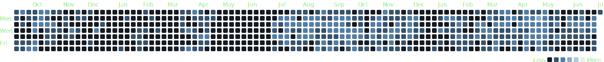
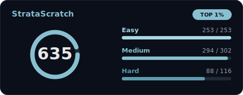

<picture>
  <source media="(prefers-color-scheme: dark)"
          srcset="https://readme-typing-svg.demolab.com?font=Inconsolata&weight=500&size=50&duration=1500&pause=50&color=FFFFFF&multiline=true&repeat=false&width=1300&height=140&lines=I+wrote+too+much+SQL+...+%F0%9F%99%81;Probably+need+to+touch+some+grass+%F0%9F%8C%B1">
  <source media="(prefers-color-scheme: light)"
          srcset="https://readme-typing-svg.demolab.com?font=Inconsolata&weight=500&size=50&duration=1500&pause=50&color=000000&multiline=true&repeat=false&width=1300&height=140&lines=I+wrote+too+much+SQL+...+%F0%9F%99%81;Probably+need+to+touch+some+grass+%F0%9F%8C%B1">
  
</picture>

## 🌐 Let's Connect 

<p align="center">
  <a href="https://www.linkedin.com/in/minhbphamm/" target="_blank">
    
  </a>
  <a href="https://leetcode.com/u/markphammm/" target="_blank">
    
  </a>
  <a href="https://platform.stratascratch.com/user/SmartPersonality1862" target="_blank">
    
  </a>
</p>

---

## 🧠 About Me 

<blockquote align="center">
  <b><i>"Analytics isn't just my job - it's my obsession. Scroll down and see for yourself"</i></b>
</blockquote>

<div align="center">
  
[](https://wakatime.com/@894cf02a-9974-42d0-acde-603cdd98fe17)


</div>

---

## 💼 Experience 

<div align="center">
  <table width="100%">
    <tr>
      <td align="center" valign="top" width="11%">
        <sub>May 2022 - Sep 2022</sub><br /><br />
        <br /><br />
        <a href="https://kpim.vn/"><b>KPIM</b></a><br />
        <sub>Data Science Intern</sub>
      </td>
      <td align="center" valign="middle" width="1%">➔</td>
      <td align="center" valign="top" width="11%">
        <sub>May 2022 - Sep 2022</sub><br /><br />
        <br /><br />
        <a href="https://en.napas.com.vn/"><b>NAPAS</b></a><br />
        <sub>Data Analyst Intern</sub>
      </td>
      <td align="center" valign="middle" width="1%">➔</td>
      <td align="center" valign="top" width="11%">
        <sub>Jan 2023 - May 2023</sub><br /><br />
        <br /><br />
        <a href="https://www.corning.com/"><b>Corning Inc.</b></a><br />
        <sub>Data Analyst Intern</sub>
      </td>
      <td align="center" valign="middle" width="1%">➔</td>
      <td align="center" valign="top" width="11%">
        <sub>Jan 2024 - May 2024</sub><br /><br />
        <br /><br />
        <a href="https://www.techsmith.com/"><b>TechSmith Corp</b></a><br />
        <sub>BI Engineer Intern</sub>
      </td>
      <td align="center" valign="middle" width="1%">➔</td>
      <td align="center" valign="top" width="11%">
        <sub>May 2024 - Aug 2024</sub><br /><br />
        <br /><br />
        <a href="https://www.lazard.com/"><b>Lazard</b></a><br />
        <sub>Data Engineer Intern</sub>
      </td>
      <td align="center" valign="middle" width="1%">➔</td>
      <td align="center" valign="top" width="11%">
        <sub>May 2025 - </sub><br /><br />
        <br /><br />
        <a href="https://insurify.com/"><b>Insurify</b></a><br />
        <sub>Analytics Engineer</sub>
      </td>
      <td align="center" valign="middle" width="1%">➔</td>
      <td align="center" valign="top" width="11%">
        <sub>May 2025 - </sub><br /><br />
        <br /><br />
        <a href="https://xomdata.com/"><b>Xóm Data</b></a><br />
        <sub>Builder</sub>
      </td>
    </tr>
  </table>
</div>

---

## 🛠️ Techstack &amp; Ecosystem 


<br/>

<div align="center">
  <h3>🛠️ Tech Stack &amp; Reference Logos</h3>
  <table width="100%">
    <tr>
      <td width="25%"><b>🏢 Data Warehouse</b></td>
      <td width="75%">
        
        
        
      </td>
    </tr>
    <tr>
      <td><b>🌊 Data Lakehouse</b></td>
      <td>
        
        
        
        
        
        
        
        
        
        
      </td>
    </tr>
    <tr>
      <td><b>🔄 Data Processing &amp; Transformation</b></td>
      <td>
        
        
        
        
        
        
        
        
      </td>
    </tr>
    <tr>
      <td><b>📥 Data Integration &amp; Reverse ETL</b></td>
      <td>
        
        
        
        
      </td>
    </tr>
    <tr>
      <td><b>⚙️ Orchestration</b></td>
      <td>
        
        
        
        
        
        
      </td>
    </tr>
    <tr>
      <td><b>📊 BI &amp; Analytics</b></td>
      <td>
        
        
        
        
        
        
        
        
        
        
      </td>
    </tr>
    <tr>
      <td><b>🚀 DevOps &amp; Cloud</b></td>
      <td>
        
        
        
        
        
        
        
      </td>
    </tr>
    <tr>
      <td><b>🤖 AI Tooling</b></td>
      <td>
        
        
        
        
      </td>
    </tr>
  </table>
</div>

## 📊 Stats 

### GitHub Stats

<div align="center">
  <table border="0" style="border-collapse: collapse; border: none;">
    <tr style="border: none;">
      <!-- Left: Contribution Cityscape (larger) -->
      <td width="58%" align="center" style="border: none; padding: 10px;" valign="middle">
        
      </td>
      <!-- Right: GitHub Stats on top, Top Languages below -->
      <td width="42%" align="center" style="border: none; padding: 10px;" valign="middle">
        
        <br /><br />
        
      </td>
    </tr>
  </table>
</div>


### Things I'm working on this week
<!--START_SECTION:waka-->

```txt
SQL          3 hrs 54 mins         ███████▒░░░░░░░░░░░░░░░░░   29.88 %
Other        2 hrs 54 mins         █████▓░░░░░░░░░░░░░░░░░░░   22.29 %
Markdown     1 hr 34 mins          ███░░░░░░░░░░░░░░░░░░░░░░   12.04 %
Python       1 hr 18 mins          ██▒░░░░░░░░░░░░░░░░░░░░░░   09.98 %
YAML         1 hr 15 mins          ██▒░░░░░░░░░░░░░░░░░░░░░░   09.62 %
```

<!--END_SECTION:waka-->

### Activity


<p align="center">
  
</p>

### Contributions

<div align="center">
  <table border="0" style="border-collapse: collapse; border: none;">
    <tr style="border: none;">
      <!-- Left: Streak stats -->
      <td width="42%" align="center" style="border: none; padding: 10px;" valign="middle">
        
      </td>
      <!-- Right: Profile details / contribution graph -->
      <td width="58%" align="center" style="border: none; padding: 10px;" valign="middle">
        
      </td>
    </tr>
  </table>
</div>

### Coding Challenges

<div align="center">
  <table border="0" style="border-collapse: collapse; border: none;">
    <tr style="border: none;">
      <td width="50%" align="center" style="border: none; padding: 10px;" valign="top">
        <a href="https://leetcode.com/u/markphammm/">
          
        </a>
      </td>
      <td width="50%" align="center" style="border: none; padding: 10px;" valign="top">
        <a href="https://platform.stratascratch.com/user/SmartPersonality1862">
          
        </a>
      </td>
    </tr>
  </table>
</div>
